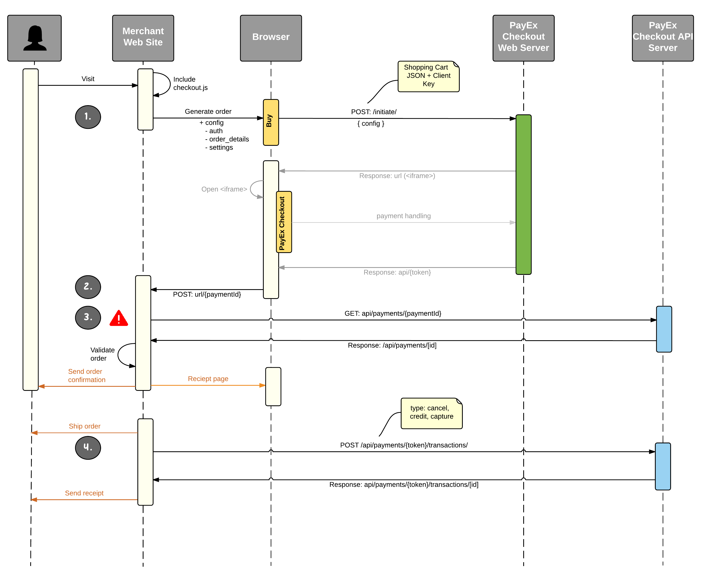

#Implementation
There are two areas that your shop must have integration to PayEx Checkout, frontend and backend.

In order to start implementing, you need to obtain a set of credentials. If you allready have the frontend and backend keys, you are good to go - otherwise go to the [credentials](credentials) section to get information of how to get hold of your set of keys.

## Sequence diagram



**Implementation steps**

1. Init order via Checkout with form action url.
2. Save `payment-id` to your backend.
3. Implement order amount check functionality via `payment-id` on the payment resource to ensure that the payment form has not been tampered with.
4. Implement capture, credit and cancel-transaction functionality to ensure economic settlement on the ordered amount to gain a sound value chain.

## Frontend

PayEx Checkout frontend is a script that bootstraps the payment process when a special button is clicked.

### Adding the script

Start by adding the PayEx Checkout script to your page.

**If HTTPS**
```html
<script src="https://checkout.staging.okb.no/Content/js/payex-checkout.min.js"></script>
```
**If HTTP**
```html
<script src="https://checkout-master.twins.bugano.net/Content/js/payex-checkout.min.js"></script>
```

### Initial configuration
Choose the button that you want to start the checkout process and add the id `pxc-button`. Then add the disable attribute - the PayEx Checkout JavaScript will enable it when it is properly loaded.
The button **MUST** be contained within a html `<form>` that POSTs to your server.

```HTML
<button id="pxc-button" disabled>Pay</button>
```

To configure PayEx Checkout you need to initialize it through the pxc.config function and pass in an configuration object with your frontend key, amount, order id and order lines.
<br/>Make sure you include this configuration after the PayEx Checkout script you included in the previous step.

```JavaScript
pxc.config({
  amount: your_amount,
	key: "your_frontend-key",
	orderId: "your_orderId",
	orderLines: [{
		itemPrice: your_item_price,
		description: "your_item_description",
		quantity:  your_item_quantity
	}]
});
```


When the payment process completes successfully, a hidden input element with a `payment-id` will be injected to the form and sent alongside any other input elements as normal to the defined form-action.

A successful request requires that the _Referer_ Header matches the one entered in the [shop settings](#shop-settings). This headers' inclusion is taken care of by the checkout-script.

If a consumer fails to complete the payment process, e.g.
 
 - insufficent funds
 - technical error
 - session timeout

or similar, we will at this moment not notify you about this. 

## Backend
After a successful payment, the shops web server receives the `payment-id` from the form-post. This ID is the key to actually capturing the now authorized payment.
To do this you have to implement a server side http request.
All requests to the [API](api) uses authentication.
using cURL or other http libraries, construct and send a [Capture](transaction#capture) request to the url:

* HTTPS : <https://checkout-api.staging.okb.no/payments/YOUR PAYMENT-ID/transactions>
* HTTP  : <http://checkout-api-master.twins.bugano.net/payments/YOUR PAYMENT-ID/transactions>

### Example

C#6 .NET 4.5.1++</br>
Using Newtonsoft.Json for serializing.

```csharp
string payment_id = HttpContext.Current.Request.Form["payment-id"];
string backend_key = "mysupersecretbackendkey";
decimal order_total_price = 100M;

HttpClient httpClient = new HttpClient();
httpClient.DefaultRequestHeaders.Add("Authorization", "Token " + backend_key);

string json = Newtonsoft.Json.JsonConvert.SerializeObject(
    new
    {
        type = "Capture",
        amount = order_total_price
    });
StringContent content = new StringContent(json, Encoding.UTF8, "application/json");

var result = httpClient.PostAsync($"https://checkout-api.staging.okb.no/{payment_id}/transactions/", content).Result;

if (result.StatusCode == HttpStatusCode.OK)
    //the payment is captured.
```
You may now test.

##Testdata
In order to test the implementation before you go live, you need to use the following testdata.

Testdata Type|Url
----|---
Creditcard|[testdata](http://www.payexpim.com/test-data/test-purchase-data/)
Invoice (Norwegian)| [testdata](http://www.payexpim.com/test-data/test-data-for-payex-faktura-no/)
Invoice (Sweden)| [testdata](http://www.payexpim.com/test-data/payex-invoice-2-0-test-data/)

##URLS

Link til urler i test og produksjon, samt go live procedure
