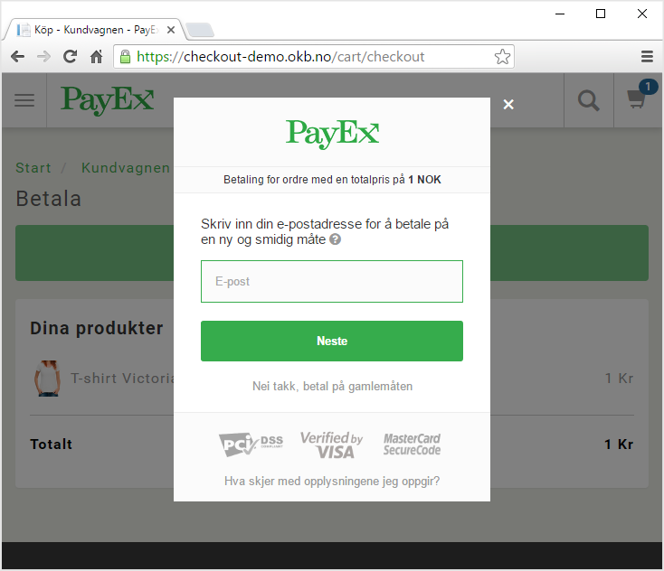
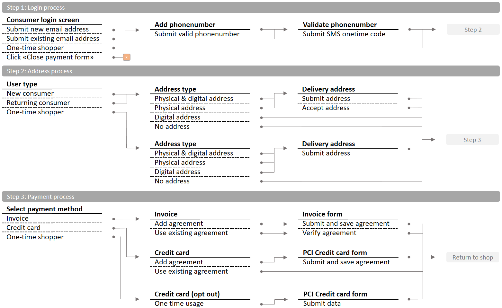

# Introduction to PayEx Checkout
**Note! This service is in private beta and currently not available to the general public.**

#What is PayEx Checkout?
PayEx Checkout is our simplest solution to enable payments on your website. PayEx Checkout is a cross-browser and cross-device supported solution for any device a potential consumer might be using. We will in simple steps explain how to integrate the website, with an embedded secure payment form and how to complete your orders from the backend server. 

*Above: Screenshot from Checkout in action, see [here](img/iphone.png) for a iPhone screenshot.

__Note!__ Consumers on desktop computers will be handled through the embedded popup, while mobile users will automatically and seamlessly be redirected to a new page in order to provide a good and responsive user experience.

##Security
PayEx Checkout is a PCI DSS compliant payment form where users can pay with different payment methods, typically all major credit cards and invoice. More payment methods will be added in the future. 

##How does it work?
On your website you create a “purchase” button, which triggers the checkout process. The consumer will at that point leave your website only return to a specified url, typically a receipt or order confirmation page, once the checkout process is finished.

The checkout process is divided into three areas

1. Login process
2. Address process
3. Payment process

Once you have shipped your order or the consumer otherwise have received the product(s), you will complete the payment with a “capture” from your backend server, and your money will be transferred to your bank account.

And that’s basically it. 

##Summary
One can summarize the solution in three steps:

1. The consumer finds something he or she likes on your website and click the purchase button
2. You send us the order and customer to the pop-up window, to be returned once the payment process is completed
3. You notify us that the order has been shipped, and we transfer the money to your bank account

Sometimes a summary simply will not cut it. To get better acquainted with the process, head over to the [getting started](gettingStarted) section.

